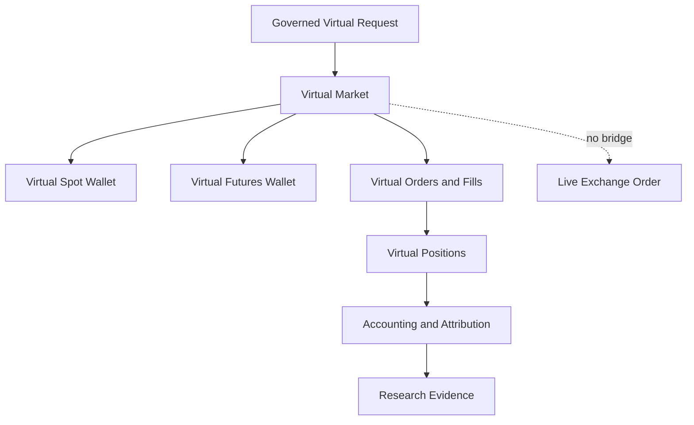

# Virtual Market Architecture

## ELI10

This evidence-backed diagram explains one bounded current part of AI4Binance. It is not new trading, risk, promotion, or execution authority.

Diagram ID: `D1501`

| Field | Value |
| --- | --- |
| Diagram level | `L1` |
| Architecture family | `D1500 — VIRTUAL MARKET` |
| Status | `CURRENT_PARTIAL` |
| Authority | `INFORMATIONAL_PROJECTION` |
| Designation | Canonical editable Mermaid source; supporting projection |
| Last verified | `2026-09-17` |

## 1. Purpose

Document the repository-grounded `Virtual Market Architecture` boundary and its relationship to the deterministic, fail-closed architecture.

## 2. Scope

This is a logical view. It does not imply a separate process, service, agent, database, Python layer, or live capability unless the listed evidence explicitly proves one.

## 3. Architectural Status

`CURRENT_PARTIAL`. The shown spine is repository-backed; adjacent coverage and operational maturity remain explicit gaps.

## 4. Authority and Source of Truth

This document is `source_of_truth: false`. `docs/governance/framework_core_vnext_governance.md`, affected contracts and schemas, and metadata-declared canonical owners govern on conflict.

## 5. Repository Evidence

- `src/ai4binance/application/virtual_runtime.py`
- `src/ai4binance/research/virtual_market.py`
- `src/ai4binance/virtual_wallet_journal.py`
- `config/research/virtual_market_acceptance.yaml`

## 6. Diagram

## 7. Components

The nodes are bounded architectural roles derived from the evidence above. Labels do not create runtime agents or authority classes.

## 8. Responsibilities

- Preserve one canonical owner per concept.
- Separate deterministic controls from advisory analysis.
- Keep missing evidence and blockers visible.

## 9. Inputs

Typed, provenance-aware repository inputs appropriate to this family, including identity, timestamps, scope, and required control context.

## 10. Outputs

Bounded typed results, explicit reason codes, lineage, and a visible blocked or unavailable state where evidence is insufficient.

## 11. Dependency Rules

Higher-authority governance, contracts, schemas, and registries constrain implementation. Logical plane, bounded context, package layer, process, service, workflow, and agent remain distinct.

## 12. Architectural Invariants

- `DETERMINISTIC_FIRST`; `LLM_ADVISORY_ONLY`.
- `RISK_VETO IS HARD`; `VALIDATION_VETO IS HARD`.
- Unknown, stale, inconsistent, unvalidated, unauthorized, or unsafe state fails closed.
- `LIVE_EXECUTION_DISABLED` and `LIVE_ORDER_BLOCKED` remain unchanged.

## 13. State / Flow Semantics

Solid arrows show allowed current information or control flow. Dashed arrows show constraints or prohibited authority shortcuts. Arrows never grant authority by themselves.

## 14. Governance Controls

Technical quality, policy eligibility, and consequential human authority are separate gates. Scores cannot hide blockers.

## 15. Risk Controls

Hard risk and validation vetoes take precedence over confidence or opportunity scores. Credentials and tool availability do not imply permission.

## 16. Security Considerations

Inputs remain untrusted until validated. Least privilege, secret isolation, path safety, provenance, and allowlists apply where relevant.

## 17. Observability

Required observations include input identity, lineage, gate outcomes, reason codes, timestamps, and explicit degraded or blocked state.

## 18. Failure Modes

Missing, corrupt, stale, inconsistent, unauthorized, or unvalidated inputs produce a visible deny, blocked, unavailable, `WAIT`, or `NO_TRADE` outcome rather than permissive fallback.

## 19. Validation / Test Evidence

- `tests/test_virtual_runtime.py`
- `tests/test_virtual_market_acceptance.py`

The paths are relevant test surfaces, not a claim that they passed in this change. Executed evidence is recorded in `diagram_validation_report.md`.

## 20. Known Gaps

Full cross-family, operational, and migration proof is incomplete. The `CURRENT_PARTIAL` label must remain until stronger machine-readable and executed evidence exists.

## 21. Current vs Target Differences

Only the solid repository-backed current spine is shown. No unimplemented target is presented as current.

## 22. Related Diagrams

- [D003 — Canonical End-to-End Architecture Diagram](../00_main/d003_canonical_end_to_end_architecture_diagram.md)

## 23. Change Impact

Semantic changes require registry, evidence, relation, contract, schema, test, security, risk, and current-vs-target review. This document does not implement runtime behavior.

## 24. Open Questions

- Which relations require stronger machine-readable proof for `CURRENT_VERIFIED`?
- Which operational evidence must be refreshed at the next review?
