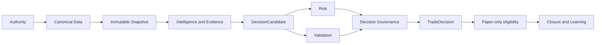

# AI4Binance Architecture Diagram Handbook

## ELI10

This handbook connects the P0 diagrams and explains how to read authority, current state, risk, validation, execution, and research boundaries.

## Architecture Thesis

AI4Binance is a research and paper-trading modular monorepo. A governed cycle uses canonical data and one immutable snapshot, produces bounded observations and a deterministic DecisionCandidate, applies independent Risk and Validation vetoes, and permits Decision Governance to produce a TradeDecision. A TradeDecision is not an order. Paper execution, closure, learning, research validation, promotion, quality, and human authority remain distinct.

## Interpretation Rules

- Authority is metadata-driven, never folder-driven.
- Logical plane, bounded context, Python layer, process, service, agent, workflow, contract, and registry are distinct.
- Risk and Validation vetoes are hard; scores cannot compensate.
- Virtual and paper results are research evidence, not live profitability or authority.
- Promotion stages require independent evidence and human governance where consequential.
- Missing or stale observability is visible, not rendered as healthy or zero.

## P0 Reading Order

- [D003 — Canonical End-to-End Architecture Diagram](00_main/d003_canonical_end_to_end_architecture_diagram.md) — `CURRENT_PARTIAL`
- [D101 — Authority Pyramid](01_governance/d101_authority_pyramid.md) — `CURRENT_PARTIAL`
- [D104 — Governance Control Plane](01_governance/d104_governance_control_plane.md) — `CURRENT_PARTIAL`
- [D202 — Modular Monorepo Architecture](02_repository/d202_modular_monorepo_architecture.md) — `CURRENT_PARTIAL`
- [D204 — Dependency Direction Diagram](02_repository/d204_dependency_direction_diagram.md) — `CURRENT_PARTIAL`
- [D310 — Canonical Market Data Architecture](03_data/d310_canonical_market_data_architecture.md) — `CURRENT_PARTIAL`
- [D406 — Immutable Shared Snapshot Flow](04_features_snapshot/d406_immutable_shared_snapshot_flow.md) — `CURRENT_PARTIAL`
- [D501 — Canonical Event Fabric](05_event_fabric/d501_canonical_event_fabric.md) — `CURRENT_PARTIAL`
- [D601 — Intelligence Capability Map](06_intelligence/d601_intelligence_capability_map.md) — `CURRENT_PARTIAL`
- [D701 — Multi-TF Architecture](07_multi_timeframe/d701_multi_tf_architecture.md) — `CURRENT_PARTIAL`
- [D901 — Evidence Architecture](09_evidence/d901_evidence_architecture.md) — `CURRENT_PARTIAL`
- [D1102 — Risk Engine](11_risk/d1102_risk_engine.md) — `CURRENT_PARTIAL`
- [D1201 — Validation Engine](12_validation/d1201_validation_engine.md) — `CURRENT_PARTIAL`
- [D1302 — Deterministic Decision Engine](13_decision/d1302_deterministic_decision_engine.md) — `CURRENT_PARTIAL`
- [D1303 — Decision Governance Engine](13_decision/d1303_decision_governance_engine.md) — `CURRENT_PARTIAL`
- [D1403 — Paper Execution Architecture](14_execution/d1403_paper_execution_architecture.md) — `CURRENT_PARTIAL`
- [D1501 — Virtual Market Architecture](15_virtual_market/d1501_virtual_market_architecture.md) — `CURRENT_PARTIAL`
- [D1602 — Opportunity Lifecycle](16_opportunity_observability/d1602_opportunity_lifecycle.md) — `CURRENT_PARTIAL`
- [D1802 — Experiment Lifecycle](18_research/d1802_experiment_lifecycle.md) — `CURRENT_PARTIAL`
- [D1901 — Research Promotion State Machine](19_promotion/d1901_research_promotion_state_machine.md) — `CURRENT_PARTIAL`
- [D2001 — Continuous Improvement Loop](20_continuous_improvement/d2001_continuous_improvement_loop.md) — `CURRENT_PARTIAL`
- [D2101 — Technology Intelligence Architecture](21_technology_intelligence/d2101_technology_intelligence_architecture.md) — `CURRENT_PARTIAL`
- [D2201 — Enterprise Ontology](22_ontology_contracts/d2201_enterprise_ontology.md) — `CURRENT_PARTIAL`
- [D2301 — Master Registry Architecture](23_registries/d2301_master_registry_architecture.md) — `CURRENT_PARTIAL`
- [D2401 — Assurance Plane](24_assurance/d2401_assurance_plane.md) — `CURRENT_PARTIAL`
- [D2501 — Security Architecture](25_security/d2501_security_architecture.md) — `CURRENT_PARTIAL`
- [D2601 — Observability Architecture](26_observability/d2601_observability_architecture.md) — `CURRENT_PARTIAL`
- [D2802 — Process Topology](28_runtime/d2802_process_topology.md) — `CURRENT_PARTIAL`
- [D2901 — Test Architecture](29_testing/d2901_test_architecture.md) — `CURRENT_PARTIAL`

## Current vs Target

The P0 set is `CURRENT_PARTIAL`; the remaining `449` required IDs are `NOT_VERIFIED`. No target is presented as implemented.

## Validation and Rendering

Run `python -m ai4binance.ops.architecture_diagram_validation`. No approved renderer exists, so rendered artifacts remain `RENDERING_NOT_AVAILABLE`.
