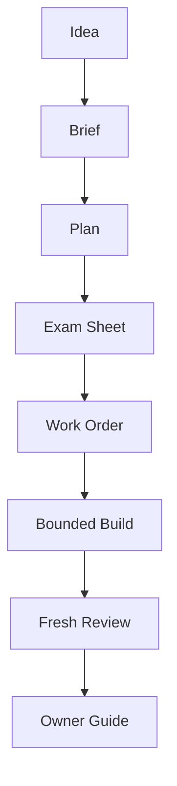

# Factory Owner Guide

The factory is a governed planning and review layer for AI4BINANCE. It helps
turn an idea into a brief, plan, test contract, handoff, review, and owner guide.
It is not a live trading executor.

## What Each Part Does

- `/factory` reads `factory/STATE.md` and routes the next factory phase.
- `/factory-plan` interviews for missing context and creates `BRIEF.md` or
  converts an approved brief into `PLAN.md`.
- `/factory-tests` adds acceptance criteria and exact proof commands before
  coding starts.
- `/factory-explain` explains the plan or result in plain language and may add
  Mermaid diagrams.
- `/factory-handoff` packages scope, tests, safety rails, and stop conditions
  into `HANDOFF.md`.
- `/factory-review` acts as a fresh reviewer and tries to break the completed
  work.
- `BACKGROUND_SHIFT` is the future background mode: it works only while the
  computer is on and the user can inspect or interrupt it.

## Mental Model

## What It Must Never Do

- It must not authorize live Spot orders.
- It must not run as a hidden unattended worker.
- It must not promote parameters without validation.
- It must not read or expose secrets.
- It must not treat wallet state as backtest evidence.
- It must not replace deterministic signal, risk, or exchange validation code.

## Current Live Status

`LIVE_ORDER_BLOCKED`
